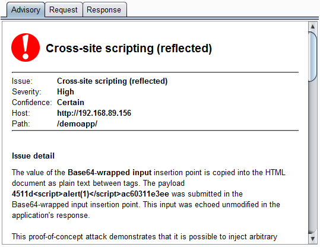
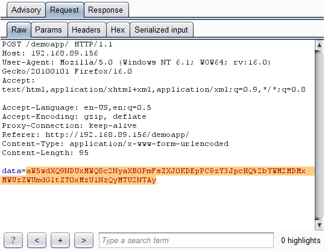
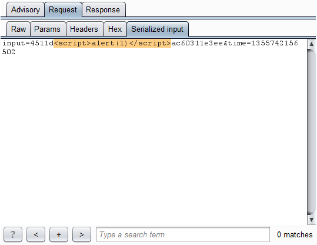

# Sample Burp Suite extension: custom scan insertion points

In the [custom editor tab example](//github.com/PortSwigger/example-custom-editor-tab), we
saw how a simple Burp extension could be used to render and edit a custom
message data format, within the Burp UI. For the purpose of demonstrating this
capability, we used a trivial serialization format, in which user-supplied
input is Base64-encoded within a request parameter value.

That example contained a rather obvious XSS vulnerability: the raw input
contained within the serialized data is echoed unfiltered in the application's
response. But although this type of bug might be obvious to a human, automated
scanners will not (in general) identify any kinds of input-based vulnerabilities
in cases where the raw input needs to be embedded within an unsupported
serialization format. Since the scanner does not understand the format, it has
no means of submitting its usual scan payloads in the way that is needed for the
application to unpack and process the payloads and trigger any bugs. This means
that in this situation, equipped only with the [example of a custom editor tab
extension](//github.com/PortSwigger/example-custom-editor-tab), you would be
restricted to manual testing for input-based bugs, which is a tedious and
time-consuming process.

The [extender API](https://portswigger.net/burp/extender/) lets you tackle this
problem by registering your extension as a provider of custom scanner insertion
points. For each actively scanned request, Burp will call out to your
extension, and ask it to provide any custom insertion points that are
applicable to the request. Each insertion point that you provide is responsible
for the job of constructing validly-formed requests for specific scan payloads.
This lets your extension work with any data format, and embed the scanner's
payloads within the request in the correct way.

Here, we can see Burp reporting the XSS vulnerability, which it has found via
the custom "Base64-wrapped input" insertion point:

Here is the request that Burp made, and which was generated for Burp by our
custom insertion point:



Here, via our custom message editor tab, is the literal scan payload that is
embedded in the request:



So, with a few lines of extension code, we have taught Burp Scanner how to work
with the unsupported serialization format. All of Burp's built-in scan checks
can now place their payloads correctly into the application's requests, and
bugs like this can be quickly found.

This repository includes source code for Java, Python and Ruby. It also contains
a sample server (for ASP.NET and NodeJS) to execute a scan against.
